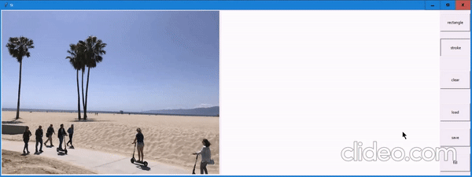

## Image Inpainting
This is a Pytorch implementation of an image inpainting module which is created to erase undesirable regions in an image.

This repository contains "Gated Convolution", "Contextual Attention" and "Spectral Normalization".

## Demo



## Requirement
- Python 3
- OpenCV-Python
- Numpy
- Pytorch 1.0+
## Compared Results
The following images are **Original**, **Masked_orig**, **Official(Tensorflow)**, [**MMEditing(Pytorch)**](https://github.com/open-mmlab/mmediting), **Ours(Pytorch)**.
### 
### 
### 
### 
### 
### 
## Dataset
### Training Dataset
The training dataset is a collection of images from [Places365-Standard](http://places2.csail.mit.edu/download.html) which spatial sizes are larger than 512 * 512. (It will be more free to crop image with larger resolution during training)
### Testing Dataset
Create the folders `test_data` and `test_data_mask`. Note that `test_data` and `test_data_mask` contain the image and its corresponding mask respectively.
## Training
* To train a model:
``` bash
$ bash ./run_train.sh
``` 
All training models and sample images will be saved in `./models/` and `./samples/` respectively.
## Testing
Download the pretrained model [here](https://drive.google.com/file/d/1uMghKl883-9hDLhSiI8lRbHCzCmmRwV-/view?usp=sharing) and put it in `./saved_model/`.
* To test a model:
```shell
python main.py
```

## A simple interactive inpainting GUI

A GUI written using tkinter is given in `painter.py`. Run the following code to launch the GUI:


```shell

python painter.py
```


## To run for a single image
- Remove all files from test_data and tesd_data_mask
- Now launch the GUI by running python painter.py
- Load the desired image
- Mask desired area and save
- Now filling the masked area will provide you with desired result

